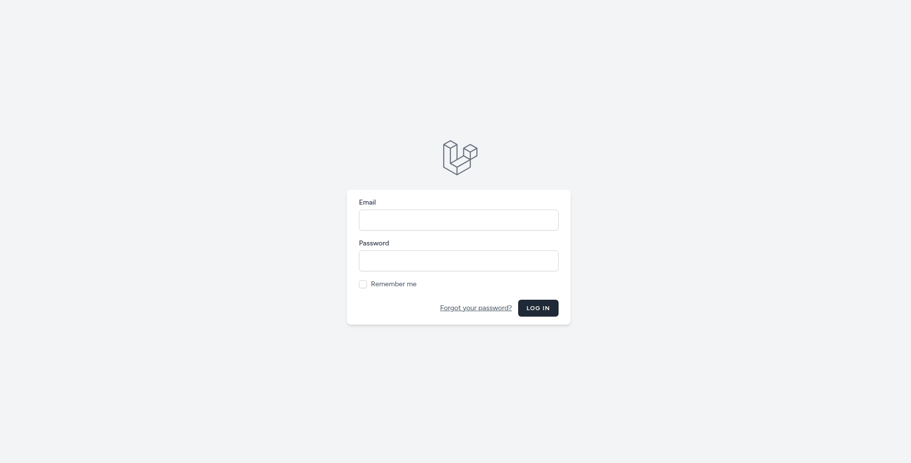
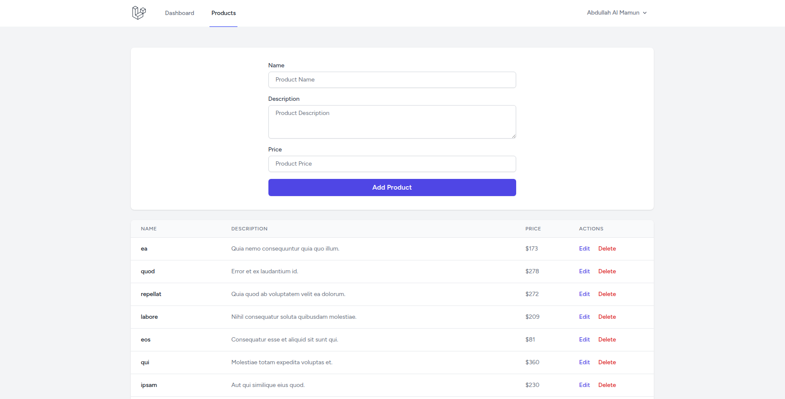

<p align="center"><a href="https://laravel.com" target="_blank"></a></p>

<p align="center">
<a href="https://github.com/laravel/framework/actions"></a>
<a href="https://packagist.org/packages/laravel/framework"></a>
<a href="https://packagist.org/packages/laravel/framework"></a>
<a href="https://packagist.org/packages/laravel/framework"></a>
</p>

## About this Project

This project was built using Laravel 12, Livewire 3.6, and tailwindcss 3.1.0 to create a dynamic and interactive web application.

### Scaffolding

```bash
composer create-project laravel/laravel .
composer require laravel/breeze --dev
php artisan breeze:install blade
composer require livewire/livewire
npm install
npm run dev
php artisan serve
http://127.0.0.1:8000/
```

### config/livewire.php

```bash
php artisan livewire:publish --config

remove
'layout' => 'components.layouts.app',
add
'layout' => 'layouts.app',
```

### resources/views/layouts/app.blade.php

```bash
<!DOCTYPE html>
<html lang="{{ str_replace('_', '-', app()->getLocale()) }}">
    <head>
        //
        <!-- Scripts -->
        @vite(['resources/css/app.css', 'resources/js/app.js'])
        @livewireStyles
    </head>
    <body class="font-sans antialiased">
        //
        @livewireScripts
    </body>
</html>
```
### Migration

```bash
php artisan migrate --seed
```
### Login


### Products


### Github

```bash
If you download this project from Github

composer install
npm install
connect database to .env
php artisan key:generate
php artisan storage:link
php artisan migrate --seed
npm run dev
php artisan serve
```

